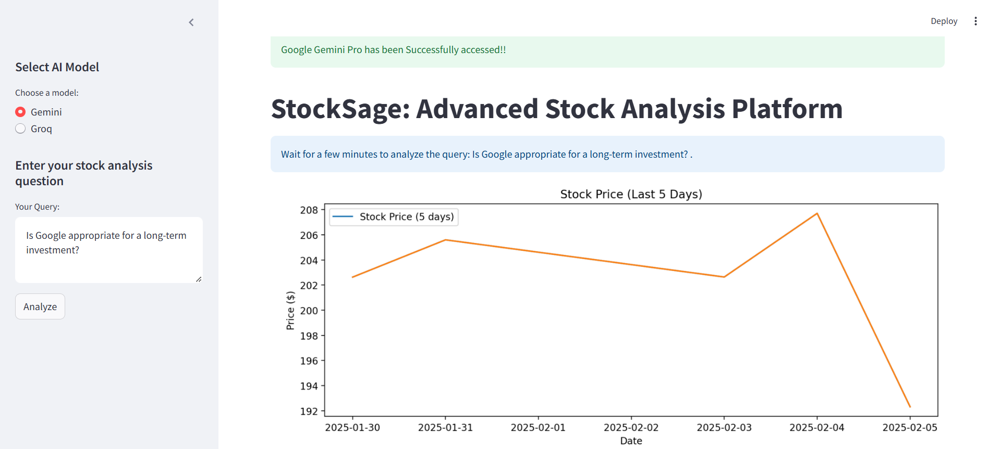
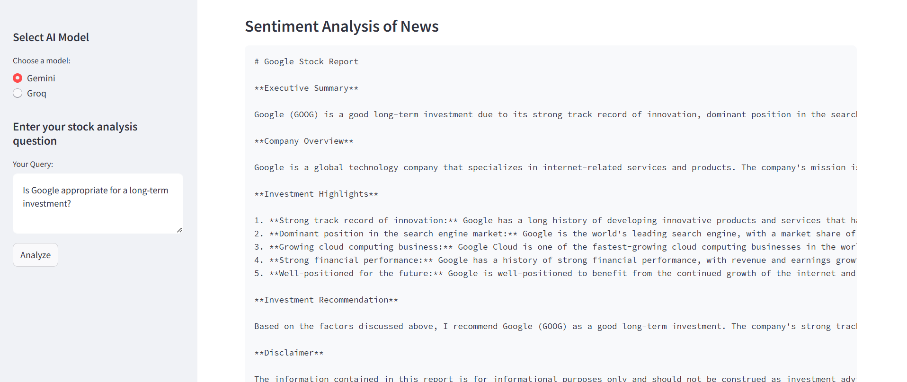
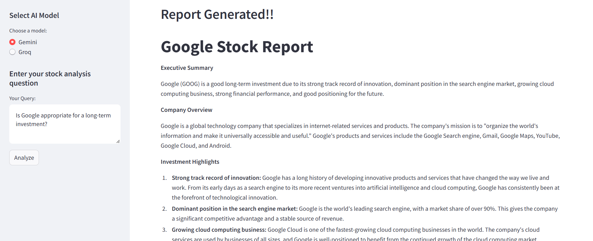

# StockSage: Advanced AI-Powered Stock Analysis Platform

StockSage is an AI platform designed to analyze stock that can assists users in researching stocks, analyzing market data, assessing risks, performing technical and fundamental analysis and fetching the latest news. Itmultiple AI agents that collaborate to gather stock information, provide in-depth insights, perform risk assessments and sentiment analysis for informed investment decisions.


## 🚀 Features

- **Stock Researcher**: Extracts and summarizes basic stock information.

- **Financial Analyst**: Conducts fundamental and technical analysis.

- **News Analyst**: Fetches recent stock-related news and analyzes sentiment.

- **Report Generator**: Compiles a detailed stock report with investment recommendations.


## 📦 Tech Stack
- **Programming Language**: Python 3.10

- **Framework**: CrewAI, Streamlit

- **AI Models**: Google Gemini Pro, Groq Gemma2-9b-it

- **APIs Used**: Yahoo Finance (yfinance)

- **Visualization**: Matplotlib, Seaborn

- **Data Handling**: Pandas, NumPy


## Set up environment variables (Create a .env file)
1. GEMINI_API_KEY = "your_gemini_api_key" 

2. GROQ_API_KEY = "your_groq_api_key" 


## 🔧 Installation

1. Clone the Repository and ensure to create a virtual environment.

2. Open Command Prompt and Docker.

3. Direct to the folder.

4. Install the dependencies.

```
pip install -r requirements.txt
```

5. Run the app.

```
streamlit run app.py
```

6. The app will run on  http://localhost:8501


## 📊 AI Agents and Tasks

The application utilizes **CrewAI** to manage different AI agents handling various stock analysis tasks:

1. **Stock Researcher** - Gathers basic stock data.

2. **Financial Analyst** - Performs risk assessment and technical/fundamental analysis.

3. **News Analyst** - Fetches news and conducts sentiment analysis.

4. **Report Writer** - Generates a structured stock analysis report.


## Screenshots

Below are screenshots of the application:

### 1. Opening Page



This is the first view of the page that appears when the application loads and user selects either the Google Gemini or Groq Google Gemma and enters the query. The stock data for last 5 days and 30 days are displayed.

### 2. Sentiment Analysis



Here, the sentiment of the stock after analyzing the news are displayed.

### 3. Report Generation



The Final report is generated after all the AI Agents performed their tasks and the output is accumulated.


## Contributions 

Contributions are welcome! If you'd like to help improve this project, please fork the repository and submit a pull request.
